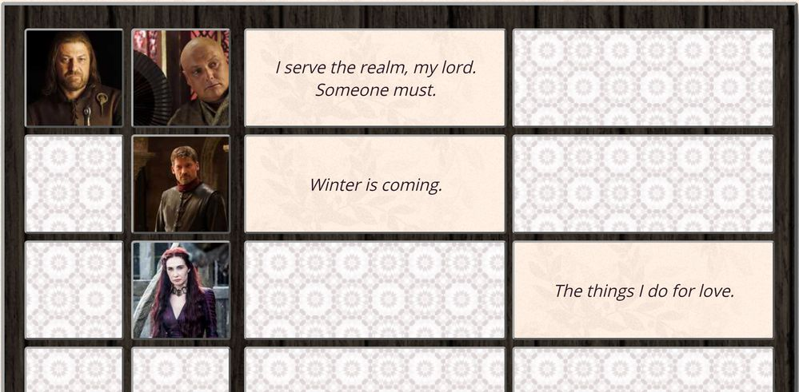
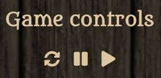
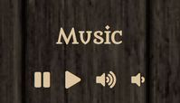
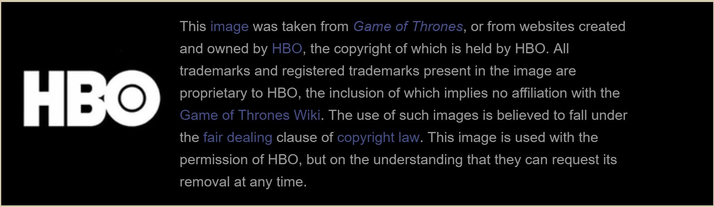

# The Game of Thrones Memory Game

## About the game
A responsive Game of Thrones themed memory game.

This is a non-commercial unofficial project intended as "fan art", not related to or endorsed by HBO.

_**When you play the game of thrones, you win or you die.**_

## Features
- Interactive gameplay
- Player "loses" a life after 10/16/22 moves
- Player "dies" after 22 moves
- Game controls: restart game, pause game, resume game buttons
- Background music for the game, sound effects when winning or losing the game
- Music controls: pause, play, volume up and volume down buttons
- Timer indicating time spent in the current game
- Win/Lose message that includes the player's stats
- Responsive design for phone/tablet

## How to play
The objective of the game is to match the 8 characters on the left side of the board with their quotations on the right side of the board.

If you are not familiar with the Game of Thrones characters, but you would like to play the game, click on the help button 
 to see a list of characters and their quotes.

To play the game, click on the cards one by one to flip them over.

The game controls allow you to restart the game, pause the game while you are away from your computer, or resume the game after a pause.

The music controls allow you to pause or resume the background music, or increase/decrease its volume.

When all cards have been matched, a "win message" will show your stats: your remaining "lives" and the time and number of moves needed to match all cards.

When you play the game of thrones, you may also die.

If that happens, enjoy the lovely sound effects and click on the reload button
 to play again.

## Credits
The project is based on a static (HTML/CSS) version provided by Udacity: https://github.com/udacity/fend-project-memory-game.

**Quotations:** My favourite quotes from A Song of Ice and Fire series/Game of Thrones TV show, quoted from memory.

**Background images**
- Webpage background patterns from Subtle Patterns
  - https://www.toptal.com/designers/subtlepatterns/arabesque/
  - https://www.toptal.com/designers/subtlepatterns/dark-wood/ (edited)
  - https://www.toptal.com/designers/subtlepatterns/xv/ (edited)
- Win/Lose message background images from https://holypsd.deviantart.com/art/Game-of-thrones-texture-pack-316846378

**Character card images** from http://gameofthrones.wikia.com, edited to fit the card size
- Ned: https://vignette.wikia.nocookie.net/gameofthrones/images/9/9c/EddardStark.jpg/revision/latest?cb=20110626030942
- Syrio Forel: https://vignette.wikia.nocookie.net/gameofthrones/images/1/1b/Arya-Stark-and-Syrio-Forel-house-stark-24506825-903-1199.jpg/revision/latest?cb=20130814173955
- Jaime: https://vignette.wikia.nocookie.net/gameofthrones/images/2/2e/GOT_Season_7_14_Jaime_Infobox.jpg/revision/latest?cb=20170715192751
- Littlefinger: https://vignette.wikia.nocookie.net/gameofthrones/images/7/74/Littlefinger_s06e04.jpg/revision/latest?cb=20160512040258
- Ygritte: https://vignette.wikia.nocookie.net/gameofthrones/images/1/10/Ygritte_season_4_promo_better_quality.jpg/revision/latest?cb=20160612150613
- Cersei: https://vignette.wikia.nocookie.net/gameofthrones/images/5/50/406_TLOGAM.jpg/revision/latest?cb=20170526145006
- Melisandre: https://vignette.wikia.nocookie.net/gameofthrones/images/8/8f/504_SOTH.jpg/revision/latest?cb=20170526144444
- Tywin: https://vignette.wikia.nocookie.net/gameofthrones/images/5/51/310_M.jpg/revision/latest?cb=20170526145336
- Hodor: https://vignette.wikia.nocookie.net/gameofthrones/images/2/29/Bran-stark-and-hodor-issac-hempstead-wright-and-kristian-nairn-helen-sloan.jpeg/revision/latest?cb=20120223001425
- Ramsay: https://vignette.wikia.nocookie.net/gameofthrones/images/1/1e/Game_of_Thrones_Season_6_15.jpg/revision/latest?cb=20160211210537
- Brienne: https://vignette.wikia.nocookie.net/gameofthrones/images/8/89/Brienne_Mother%27s_Mercy.jpg/revision/latest?cb=20150617011915
- Sam: https://vignette.wikia.nocookie.net/gameofthrones/images/e/e3/GOT_Season_7_07.jpg/revision/latest?cb=20170612172525
- Tyrion: https://vignette.wikia.nocookie.net/gameofthrones/images/4/4c/706_Tyrion_Dragonstone.jpg/revision/latest?cb=20170816092408
- Arya: https://vignette.wikia.nocookie.net/gameofthrones/images/3/39/65.jpg/revision/latest?cb=20150619053130
- Varys: https://vignette.wikia.nocookie.net/gameofthrones/images/a/a9/103-Varys.jpg/revision/latest?cb=20170726043644
- Daenerys: https://vignette.wikia.nocookie.net/gameofthrones/images/0/0d/703_TQJ.jpeg/revision/latest?cb=20171210083903

License info from http://gameofthrones.wikia.com:

**Sound effects** from https://freesound.org
- Background music: https://freesound.org/people/SoundFlakes/sounds/423499/
- Win message: https://freesound.org/people/FunWithSound/sounds/369252/
- Lose message: https://freesound.org/people/Aeonemi/sounds/180330/

**Code**
- CSS animations from https://www.w3schools.com/css/css3_animations.asp
- Shuffle function from http://stackoverflow.com/a/2450976
- Score panel timer based on code from https://jsfiddle.net/Daniel_Hug/pvk6p/
